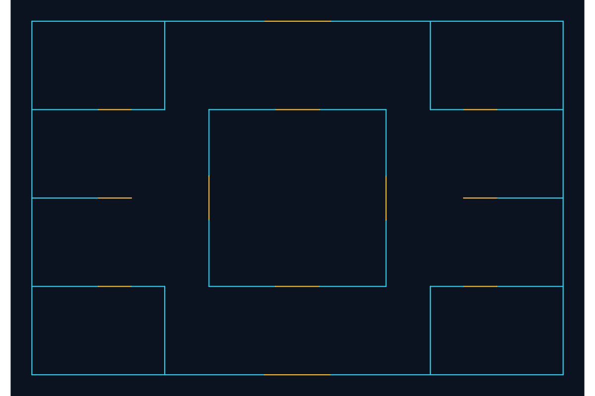

# WADScope

[](https://github.com/davidcostacv/wadscope/actions/workflows/ci.yml)

**From bytes and disassembly to visible DOOM map geometry.**

WADScope investigates the compiled WAD loader in Chocolate Doom 3.1.1 and builds an independent Python inspector from the recovered structure. Findings connect sample bytes, executable addresses, later source comparisons, and reproducible tests.

**Working development checkpoint:** archive inspection, JSON listing, indexed extraction, bounded classic-map decoding, and SVG export. Windows/Linux CI validates the installed package on Python 3.11, 3.12, and 3.14. The engine-view comparison and release video remain pending.



*Original demonstration: 46 vertices, 40 segments. Cyan indicates one-sided metadata; amber indicates two-sided metadata. This is a reproducible geometry sample, not a playable game map.*

[Archive findings](docs/research/findings.md) · [Map investigation](docs/research/maps.md) · [Reproduction](docs/research/walkthrough.md) · [Performance](docs/performance.md) · [Portfolio notes](docs/portfolio.md)

## Try it in Windows PowerShell

Install Python and Git, then run:

```powershell
git clone https://github.com/davidcostacv/wadscope.git
Set-Location .\wadscope
python -m venv .venv
.\.venv\Scripts\python.exe -m pip install -e .
.\.venv\Scripts\python.exe -m unittest discover -s tests -v
.\.venv\Scripts\python.exe examples/create_demo.py
.\.venv\Scripts\python.exe -m wadscope inspect .\local\demo-map.wad --json
.\.venv\Scripts\python.exe -m wadscope list .\local\demo-map.wad --json
.\.venv\Scripts\python.exe -m wadscope extract .\local\demo-map.wad --index 2 --output .\local\linedefs.bin --overwrite
.\.venv\Scripts\python.exe -m wadscope map-svg .\local\demo-map.wad --map-index 0 --output .\local\map.svg --overwrite
```

The builder writes an original WAD under ignored `local/` and recreates the committed preview. Opening `local/map.svg` shows the CLI export. The extraction command produces the 560-byte LINEDEFS resource. No commercial game assets are needed.

Runtime and tests use the Python standard library: no external runtime dependencies, paid API, or LLM tokens. Packaging tools may require a download during installation. Optional AI assistance can help explain findings or review proposed changes; verified bytes and executed experiments remain the evidence.

## Capabilities

| Command | Result |
| --- | --- |
| `inspect FILE [--json]` | Signature, size, directory position, count, compatibility warnings |
| `list FILE [--json]` | Original indexes, names, raw name hex, offsets, and sizes |
| `extract FILE --index N --output PATH` | Exact resource bytes at an explicit destination |
| `map-svg FILE --map-index N --output PATH` | Classic vertices and linedefs rendered as SVG |

Indexes distinguish duplicate resource names and duplicate map markers. Inspection preserves zero-length markers and valid overlapping extents. Structural faults produce explicit errors.

Extraction and SVG publication refuse existing destinations unless `--overwrite` is supplied, protect source aliases, and publish complete temporary sibling files. Failed reads preserve existing output. Parent directories must exist. Default no-overwrite publication requires filesystem hard-link support and fails explicitly when unavailable.

Policy limits default to 100,000 directory entries, 64 MiB per selected resource, and 100,000 vertices/lines each. Controlled overrides use `--max-entries`, `--max-lump-size`, `--max-vertices`, and `--max-lines`; geometry flags apply to `map-svg`. Exit codes are 0 for success, 1 for operational failures, and 2 for argument errors.

## Evidence behind the result

- **Pinned provenance:** executable and sample hashes, architecture, versions, licenses, and toolchain are recorded in the [manifest](docs/research/target.md).
- **Archive layout:** sample bytes and loader instructions support the twelve-byte header and sixteen-byte directory stride. Runtime objects have a different size; the report explains that distinction.
- **Lookup behavior:** a traced backward scan supports later duplicate-name precedence. Source-consultation history and the untraced hash-table construction are disclosed.
- **Geometry:** assembly shows four-byte vertex reads, signed coordinate expansion, and fourteen-byte linedef input strides. The pinned source corroborates the identifications after the observations were recorded.
- **Independent validation:** E1M1 in the hashed Freedoom sample decodes to 1,196 vertices and 1,175 lines. Selected records match independent byte inspection; SVG endpoints and line count are checked separately.
- **Measured efficiency:** 64 KiB directory batching reduced the recorded Freedoom median from 9.655 ms to 2.202 ms against an equivalent single-record reference. The [benchmark](docs/performance.md) includes repetitions, hashes, allocation peaks, and limits.

The test suite covers malformed input, duplicate names, overlaps, block boundaries, truncation, source aliases, legacy Windows encodings, map boundaries, resource limits, invalid endpoints, and SVG transforms. The [CI workflow](.github/workflows/ci.yml) builds and tests the installed package across six environment combinations.

WAD is documented and Chocolate Doom is open source. The contribution is the investigation trail and tested reconstruction, not a claim to have discovered an unknown format. Ghidra is needed to reproduce the binary research, not to run the tool.

## Real-world applications

1. **Legacy data preservation:** inspect metadata and recover supported resources for archival or migration workflows.
2. **Interoperability and modding:** expose archive contents and map geometry independently of the original engine, with SVG as a standard output.
3. **Compatibility investigation:** distinguish legal edge cases from structural faults and explain differences between loader behavior and inspector policies.

The method transfers to other formats, but each new format needs its own investigation and implementation.

## Supported scope

The [archive policy](docs/format/wad.md) and [map policy](docs/format/maps.md) define acceptance precisely. Map previews require a canonical consecutive classic ten-lump block; selection stops at the next recognized marker. Selected spans containing BEHAVIOR, TEXTMAP, or ZNODES are rejected explicitly.

The preview draws linedef geometry. It does not validate textures, sectors, BSP data, collision, or playability, and dialect checks do not detect every possible extension. A successful preview is not a guarantee that the engine accepts the complete map.

## Roadmap

- [x] Publish pinned archive and map investigations with binary evidence.
- [x] Build inspection, safe extraction, geometry decoding, and SVG export.
- [x] Publish an original reproducible visual example and passing Windows/Linux CI.
- [x] Measure directory I/O and production Python allocation peaks.
- [ ] Compare a real export with an actual engine reference view.
- [ ] Record the 60–90 second demo and publish a verified v0.1.0 release.

The [implementation plan](docs/superpowers/plans/2026-10-02-wadscope.md) tracks individual gates. [Portfolio notes](docs/portfolio.md) contain substantiated CV wording and interview explanations.

## License and assets

Original repository content uses the [MIT License](LICENSE). Downloaded executables, game archives, and raw decompilation remain outside Git. [Chocolate Doom](https://github.com/chocolate-doom/chocolate-doom) and [Freedoom](https://github.com/freedoom/freedoom) retain their own licenses. The project license does not replace upstream licenses; provenance and redistribution requirements are recorded in the manifest. The committed preview uses original geometry only.
